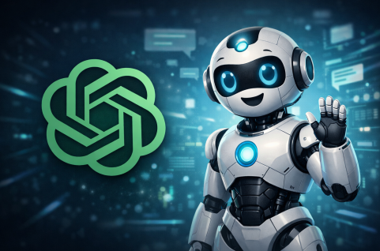
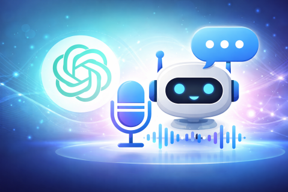

# Telegram ChatGPT Bot

A versatile Telegram bot that integrates with OpenAI's ChatGPT to provide various interactive features.



---

### ✔ Core Features:

- **Random Fact Generator** - Get interesting facts with AI-generated content
- **ChatGPT Interface** - Direct chat with OpenAI's ChatGPT
- **Celebrity Chat** - Chat with AI personalities

### ✔ Optional Features 

- **Story Writer** - AI-generated stories from a selected style and keywords
- **Voice ChatGPT** - Voice-based conversation with ChatGPT


---

### ✔ Prerequisites

- Python 3.8+
- Telegram Bot Token
- OpenAI API Key
- Required Python packages (see `requirements.txt`)
- ffmpeg 

---

### ✔ Installation

Clone the repository:

```
git clone <repository-url>
cd open_ai_telegram_bot
```

Create and activate a virtual environment:

```
python -m venv venv
source venv/bin/activate  # On Windows: venv\Scripts\activate
```

Install dependencies:

```bash
pip install -r requirements.txt
```

Create a `.env` file in the project root and add your tokens:

```
TELEGRAM_BOT_TOKEN=your_telegram_bot_token
OPENAI_API_KEY=your_openai_api_key
```

---

### ✔ ffmpeg Note

Voice Chat functionality requires **ffmpeg** to be installed on your system.
ffmpeg is used internally by audio processing libraries and is not included
in `requirements.txt`.

Make sure ffmpeg is available in your system PATH before using voice features.



---

### ✔ Usage

Start the bot:

```bash
python src/bot.py
```

In Telegram, find your bot using the username you set up and start a chat.

Available commands:

- `/start` - Start the bot
- `/random` - Get a random fact
- `/gpt` - Chat with ChatGPT
- `/talk` - Chat with a celebrity personality
- `/story` - Generate story based on keywords
- `/voice` - Voice chat with ChatGPT

---

### ✔ Project Structure

```
open_ai_telegram_bot
├── .env.example         # Example environment variables
├── .gitignore           # Git ignore file
├── README.md            # This file
├── requirements.txt     # Project dependencies
├── assets/              # Image assets for README file
└── src/
    ├── bot.py           # Main bot application
    ├── config.py        # Configuration settings
    ├── gpt.py           # GPT integration module
    ├── handlers.py      # Bot command handlers
    ├── utils.py         # Utility functions
    └── resources/       # Resource files
        ├── images/      # Image assets for the bot
        ├── messages/    # Message templates
        │   └── start.txt
        └── prompts/     # AI prompt templates
            ├── gpt.txt
            ├── random.txt
            ├── story.txt
            ├── talk_guido_van_rossum.txt
            ├── talk_linus_torvalds.txt
            ├── talk_mark_zuckerberg.txt
            └── voice.txt
```

---

### ✔ Environment Variables

The following environment variables need to be set:

- `TELEGRAM_BOT_TOKEN`: Your Telegram Bot Token from @BotFather
- `OPENAI_API_KEY`: Your OpenAI API key

---

### ✔ Contributing

- Fork the repository
- Create a new branch for your feature
- Commit your changes
- Push to the branch
- Create a new Pull Request


---

### ✔ License

This project is licensed under the MIT License - see the [LICENSE](LICENSE) file for details.


